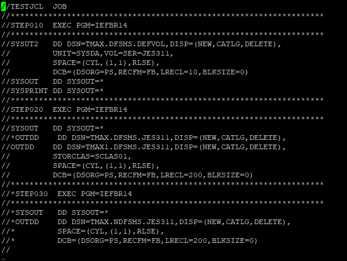
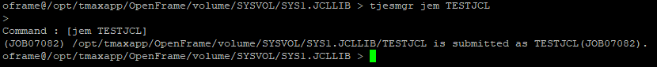
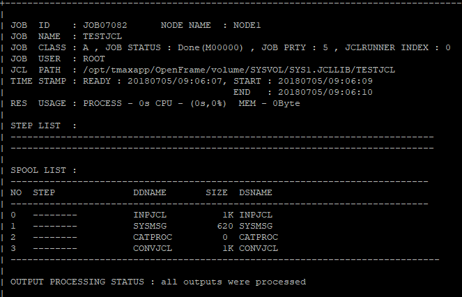
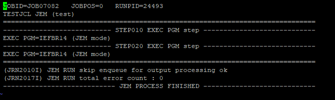

Using Tjesmgr JCL SCAN
======================

-   Execution

-   Result Verification

Here is our test JCL:

Executing the JCL SCAN Command (JEM)
------------------------------------

> tjesmgr jem &lt;JOBNAME&gt;

Ex.

Checking Results from JCL SCAN 
-------------------------------

This process is the same for checking any JOB. The JCL was not run
during the JCL SCAN, but a JOB was submitted to do syntax checking and
dataset checks to see if any were already catalogued.

Therefore, we can use the same commands as if checking any other job

> tjesmgr psj &lt;JOBID&gt;

Here, we can check the SYSMSG for any syntax related issues, or Dataset
issues.

While in tjesmgr …

> podd @j di=1
>
> or
>
> podd &lt;JOBID&gt; di=1

